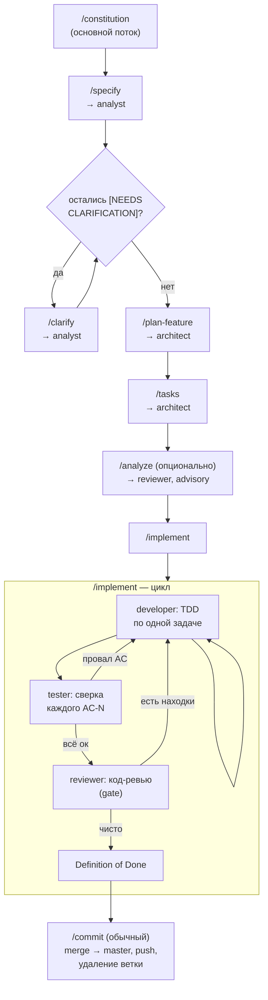

# Как здесь разрабатывают: SDD-процесс

Этот проект — учебный полигон для отработки spec-driven development (SDD) поверх мультиагентной разработки в Claude Code. Игра — предлог; процесс — цель. Все решения ниже подчинены этой цели: понятность и воспроизводимость процесса важнее скорости написания кода игры.

Подход — гибрид: фазы и артефакты вдохновлены [GitHub spec-kit](https://github.com/github/spec-kit) (`constitution → specify → clarify → plan → tasks → analyze → implement`), но сам механизм построен нативно на примитивах Claude Code — slash-командах (`.claude/commands/`) и именованных субагентах (`.claude/agents/`), а не установкой spec-kit CLI.

## Конвейер ролей

Каждая фаза — независимый субагент со своим контекстом (аналитик → архитектор → разработчик → тестировщик → ревьюер), не персона в общем диалоге. Полное описание ролей и их инструментов — в таблице ниже; сами определения — в [`../.claude/agents/`](../.claude/agents/).

| Субагент | Роль | Может писать код? | Инструменты |
|---|---|---|---|
| `analyst` | Сценарии и acceptance criteria (`AC-N`) в `spec.md` | Нет — только `spec.md` | Read, Grep, Glob, Write, WebSearch |
| `architect` | Техническое решение (`plan.md`) и разбивка на задачи (`tasks.md`) | Нет — только `plan.md`/`tasks.md` | Read, Grep, Glob, Write |
| `developer` | Реализация одной задачи по TDD (red-green-refactor) | Да | Read, Write, Edit, Bash*, Grep, Glob |
| `tester` | Сверка реализации со всеми `AC-N`, интеграционные тесты | Да (тесты) | Read, Write, Edit, Bash*, Grep, Glob |
| `reviewer` | Независимая проверка: документы (`/analyze`) или код (gate перед commit) | Нет | Read, Grep, Glob, Bash*, ReportFindings |

\* `Bash` у developer/tester/reviewer — только build/test/lint-команды. Git-команды им недоступны и не должны использоваться.

`AskUserQuestion` намеренно отсутствует у всех субагентов — это ограничение платформы: субагенты не могут задавать вопросы пользователю напрямую (вызов инструмента завершается ошибкой). Когда роли нужно решение пользователя, она останавливается и возвращает оркестратору блок `## ВОПРОСЫ ПОЛЬЗОВАТЕЛЮ`; оркестрирующая команда в основном потоке задаёт эти вопросы через `AskUserQuestion` и возвращает ответы тому же вызову субагента через `SendMessage`, чтобы он закончил работу с полным контекстом. Этот механизм зашит в каждую из команд `/specify`, `/clarify`, `/plan-feature`, `/tasks`, `/implement`.

## Два принципа, без которых холодный старт субагентов не работает

1. **Артефакты — единственная память между вызовами.** Субагент не видит историю диалога и не помнит, что делал предыдущий вызов той же роли (даже на соседней задаче той же фичи). Всё важное для следующего шага должно быть зафиксировано в файле — коде, `tasks.md`, `plan.md` — а не только сказано в ответе агента.
2. **Git-операции — исключительно в основном потоке.** Ни один субагент не выполняет `git branch/checkout/commit/push/merge`. Ветку фичи создаёт оркестрирующая команда (`/specify`) до вызова `analyst`; коммиты — только через `/commit` в основном потоке, под контролем пользователя.

## Acceptance Criteria как сквозной идентификатор

`spec.md` нумерует критерии (`AC-1`, `AC-2`, …) — это единственная связка между фазами: `tasks.md` ссылается на `AC-N` в каждой задаче, `tester` сверяет каждый `AC-N` отдельно, `/analyze` проверяет, что ни один `AC-N` не остался без покрывающей задачи.

## `[P]` в `tasks.md`

Маркер потенциально параллелизуемых задач. В текущей версии `/implement` не используется для реального параллелизма — задачи выполняются строго последовательно. Зарезервирован на будущее (изолированные dev-агенты через `isolation: "worktree"` на независимые группы задач).

## Стыковка с `/commit`

Глобальный `/commit` по умолчанию мержит текущую ветку в `master`, пушит и удаляет её. SDD-фаза живёт на одной feature-ветке от `/specify` до конца `/implement`, поэтому все промежуточные коммиты внутри фазы вызывают `/commit` с аргументом «только закоммить, не мержи и не пушь».

| Команда | Артефакт | `/commit` |
|---|---|---|
| `/constitution` | `.specify/memory/constitution.md` | «только закоммить» на фиче; обычный — если правка сделана прямо в `master` |
| `/specify` | `specs/NNN-feature-name/spec.md`, создаёт ветку | «только закоммить» |
| `/clarify` | правки в `spec.md` (обязательный гейт, если остались `[NEEDS CLARIFICATION]`) | «только закоммить» |
| `/plan-feature` | `plan.md` | «только закоммить» |
| `/tasks` | `tasks.md` | «только закоммить» |
| `/analyze` | только отчёт (advisory) | не требуется |
| `/implement` | код + чек-боксы `tasks.md` | по ходу — «только закоммить»; в конце (Definition of Done) — **обычный** `/commit` |

## Definition of Done для `/implement`

Все задачи `tasks.md` закрыты **и** `tester` подтвердил каждый `AC-N` **и** `reviewer` не имеет открытых находок (или пользователь явно принял оставшиеся). Только тогда — финальный `/commit`.

## Когда безопасно вызывать `/clear`

`/clear` очищает только диалог, а не файлы на диске — поэтому вопрос не «потеряются ли артефакты», а «есть ли что-то важное, что существует только в контексте разговора и ещё не зафиксировано ни в одном файле».

**Можно и нужно — после:**

- `/constitution`, `/specify`, `/clarify`, `/plan-feature`, `/tasks` — каждая замыкается на файл-артефакт (`constitution.md`/`spec.md`/`plan.md`/`tasks.md`), который следующий субагент прочитает с нуля независимо от истории диалога (см. принцип «Артефакты — единственная память между вызовами» выше). Ответы на вопросы через `AskUserQuestion` к моменту завершения команды уже свёрнуты в текст артефакта — держать их в контексте дальше незачем. Лучше чистить не сразу после самой команды, а после следующего за ней промежуточного `/commit` («только закоммить») — иначе есть риск забыть закоммитить.
- Финальный `/commit` в конце `/implement` (после Definition of Done) — фича полностью слита в `master`, весь смысл диалога зафиксирован в коде и истории git.

**Нельзя — после:**

- `/analyze` — отчёт ревьюера advisory-only и нигде не сохраняется (в таблице «Стыковка с `/commit`» пометка «не требуется» означает и отсутствие файла-артефакта). Пока находки не разобраны — не перенесены правками в `spec.md`/`plan.md`/`tasks.md` или явно не отклонены — `/clear` теряет их безвозвратно.
- В любой точке **внутри** `/implement`, до наступления Definition of Done. Между фазами коммитов нет (раздел 1, шаг 5: «Коммит после фазы НЕ делай»), изменения копятся в рабочем дереве незакоммиченными; счётчик циклов «tester → доработка» (лимит 2), ещё не занесённые в `tasks.md` находки `reviewer` и текущее место оркестратора в цикле по фазам существуют только в диалоге. `/clear` здесь не столько теряет файлы, сколько отрезает возможность безопасно продолжить или разобраться в состоянии сессии — придётся вручную реконструировать её по `git status`/`git diff` и чек-боксам `tasks.md`.

## Роль встроенного Plan Mode

Plan Mode Claude Code не используется как механизм фазы `/plan-feature` — он пишет один эфемерный файл вне репозитория, а артефакт SDD-фазы должен закоммититься в `specs/NNN/plan.md` и жить в истории проекта. Роль Plan Mode здесь — вспомогательная дисциплина: можно включать вручную перед рискованной задачей внутри `/implement`, или использовать встроенные Explore/Plan-субагенты для ресёрча по крупным фичам.

## Полный список команд

`/constitution`, `/specify`, `/clarify`, `/plan-feature`, `/tasks`, `/analyze`, `/implement` — определения в [`../.claude/commands/`](../.claude/commands/).
