# Модель данных: Управление лягушкой (001-frog-movement)

Ссылка из `plan.md` (AC-12: логика отделена от рендера и тестируема без DOM/canvas).

## `FrogState`

Единственная сущность, вводимая этой фичей. Мутируется на месте функцией `updateFrog` (не аллоцируется заново каждый кадр — принцип III конституции).

| Поле | Тип | Смысл |
|---|---|---|
| `x` | `number` | Левый край лягушки, px, абсолютные координаты canvas по горизонтали. |
| `isAirborne` | `boolean` | `true`, пока лягушка в любом прыжке (вертикальном или боковом — AC-7/AC-8/AC-9 не различают их поведенчески, см. `plan.md`). |
| `jumpElapsedSeconds` | `number` | Время, прошедшее с начала текущего прыжка; `0`, когда `isAirborne === false`. |
| `jumpOffsetY` | `number` | Вертикальное смещение над «землёй» в px, `0` = на земле; вычисляется каждый `updateFrog` из `jumpElapsedSeconds` и `activeJumpHeightPx` по параболе. Пересчитывается, а не хранится независимо, чтобы не было двух источников истины. |
| `activeJumpHeightPx` | `number` | Высота параболы текущего прыжка в px. Фиксируется один раз в момент старта прыжка: равна `JUMP_HEIGHT_PX`, либо, если на этом кадре лягушка была в состоянии `Crouching`, — `JUMP_HEIGHT_PX * CROUCH_JUMP_HEIGHT_MULTIPLIER` (AC-14: прыжок из приседа выше обычного). Не пересчитывается динамически до приземления — см. `plan.md`. |
| `isCrouching` | `boolean` | `true`, когда зажат Left Ctrl и `isAirborne === false` (AC-10, AC-11). Пересчитывается каждый кадр из входа, отдельного перехода не хранит — этим же пересчётом объясняется мгновенный переход в `false` при старте прыжка (AC-14). |

Начальное состояние (`createFrogState()`): `x` — центр видимой ширины canvas (не зафиксировано AC как требование, разумный дефолт), `isAirborne = false`, `jumpElapsedSeconds = 0`, `jumpOffsetY = 0`, `activeJumpHeightPx = JUMP_HEIGHT_PX` (значение не используется, пока `isAirborne === false`; переопределяется на старте каждого прыжка), `isCrouching = false`.

## `FrogInput`

Снимок состояния клавиатуры на один кадр, производится `game/input.ts` (impure), потребляется `game/frog.ts` (pure).

| Поле | Тип | Смысл |
|---|---|---|
| `moveLeft` | `boolean` | Зажата стрелка влево (`ArrowLeft`) в момент чтения. |
| `moveRight` | `boolean` | Зажата стрелка вправо (`ArrowRight`) в момент чтения. |
| `crouch` | `boolean` | Зажат `ControlLeft` в момент чтения. |
| `jumpRequested` | `boolean` | One-shot: `true` только на первом кадре после `keydown` пробела (не автоповтор ОС), сбрасывается в `false` после чтения `read()`. Не блокируется `crouch` — прыжок запрашивается независимо от того, приседает ли сейчас лягушка (AC-14). |

## Диаграмма состояний (вертикальная ось + приседание)

```mermaid
stateDiagram-v2
    [*] --> Grounded
    Grounded --> Airborne: jumpRequested (AC-5, AC-8)
    Airborne --> Grounded: jumpElapsedSeconds >= JUMP_DURATION_S (приземление, AC-5)
    Grounded --> Crouching: crouch удержан (AC-10)
    Crouching --> Grounded: crouch отпущен
    Crouching --> Airborne: jumpRequested (AC-14) — прыжок не блокируется приседанием; activeJumpHeightPx = JUMP_HEIGHT_PX * CROUCH_JUMP_HEIGHT_MULTIPLIER
    Airborne --> Airborne: jumpRequested игнорируется (AC-7)
    note right of Airborne
      Приседание недоступно (AC-11);
      горизонтальное движение (AC-1–AC-4, AC-9)
      работает одинаково в обоих состояниях.
    end note
    note right of Crouching
      Прыжок из этого состояния разрешён (AC-14)
      и выше обычного прыжка из Grounded;
      величина разницы — tuning-параметр,
      не фиксируется спекой.
    end note
```

Горизонтальная позиция (`x`) — независимая ось, обновляется в каждом состоянии одинаково (AC-9), поэтому не выделена отдельным состоянием на диаграмме.
