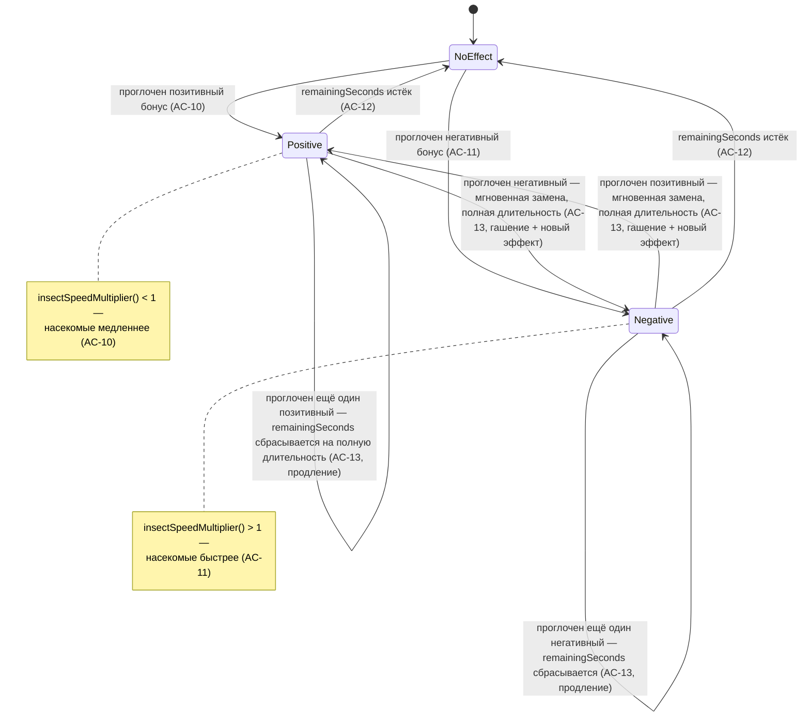
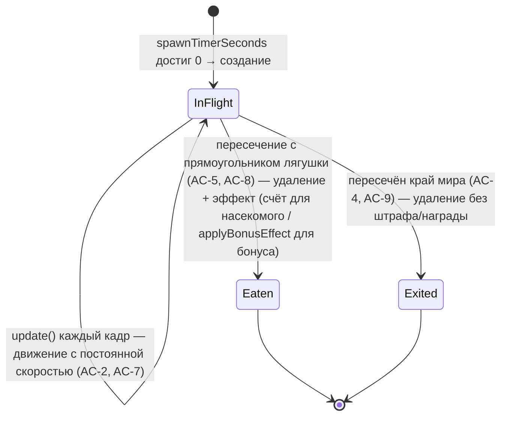

# Модель данных: Насекомые и бонусы (002-insects-and-bonuses)

Ссылка из `plan.md` (AC-16: логика отделена от рендера и тестируема без DOM/canvas). Дополняет `data-model.md` `001-frog-movement` (`FrogState`/`FrogInput` не меняются этой фичей).

## `Rect` (`game/geometry.ts`)

Общий тип для прямоугольной зоны столкновений — переиспользуется `getFrogRect()` (`game/frog.ts`), `Insect` и `Bonus`.

| Поле | Тип | Смысл |
|---|---|---|
| `x` | `number` | Левый край, px, абсолютные координаты canvas. |
| `y` | `number` | Верхний край, px, абсолютные координаты canvas (ось Y растёт вниз). |
| `width` | `number` | Ширина, px. |
| `height` | `number` | Высота, px. |

`rectsIntersect(a: Rect, b: Rect): boolean` — стандартный AABB-тест пересечения по обеим осям.

## `Insect` / `InsectsState` (`game/insects.ts`)

| Поле | Тип | Смысл |
|---|---|---|
| `type` | `'mosquito' \| 'dragonfly'` | Влияет на очки при поедании (AC-6) и на визуальное отличие в рендере (AC-1). |
| `x`, `y`, `width`, `height` | `number` | Текущий ограничивающий прямоугольник, px. |
| `vx`, `vy` | `number` | Базовая скорость по осям, px/s, фиксируется при спавне в зависимости от точки входа; не включает текущий множитель бонусного эффекта (он применяется каждый кадр отдельно в `updateInsects`, не «запекается» в насекомое — AC-10/AC-11). |

`InsectsState`: `{ list: Insect[]; spawnTimerSeconds: number }`.

Точка входа (`InsectEntryPoint = 'top' | 'left' | 'right'`) определяет `vx`/`vy` и начальную позицию, но не хранится в самом `Insect` после спавна — она полностью выражена через знаки `vx`/`vy` и стартовые координаты, отдельное поле не нужно (принцип I).

## `Bonus` / `BonusesState` (`game/bonuses.ts`)

| Поле | Тип | Смысл |
|---|---|---|
| `sign` | `'positive' \| 'negative'` | Определяет эффект при поимке (AC-10/AC-11) и цвет в рендере (AC-17). |
| `x`, `y`, `width`, `height` | `number` | Ограничивающий прямоугольник, px. Горизонтальная скорость отсутствует как поле (не `vx = 0`, а именно отсутствие) — AC-7 требует строго вертикальное падение. |

`BonusesState`: `{ list: Bonus[]; spawnTimerSeconds: number }`. Вертикальная скорость падения — единая константа `BONUS_FALL_SPEED_PX_S`, одинаковая для обоих знаков (спецификация не требует различия скорости падения по знаку — только визуальную различимость, AC-17).

## `BonusEffectState` (`game/effects.ts`)

| Поле | Тип | Смысл |
|---|---|---|
| `sign` | `'positive' \| 'negative' \| null` | `null` = эффект неактивен, насекомые двигаются с базовой скоростью. |
| `remainingSeconds` | `number` | Оставшееся время действия эффекта; `0`, когда `sign === null`. |

### Диаграмма состояний эффекта (AC-10–AC-13)

Все четыре перехода «проглочен бонус» (`NoEffect→Positive`, `NoEffect→Negative`, `Positive→Positive`, `Positive→Negative`, `Negative→Negative`, `Negative→Positive`) реализованы одной и той же функцией `applyBonusEffect(state, sign)` без ветвления по предыдущему `state.sign` — см. обоснование в `plan.md` §`game/effects.ts`.

## `WorldState` (`game/world.ts`)

| Поле | Тип | Смысл |
|---|---|---|
| `frog` | `FrogState` | Без изменений, `001-frog-movement`. |
| `insects` | `InsectsState` | Список насекомых в кадре + таймер спавна. |
| `bonuses` | `BonusesState` | Список бонусов в кадре + таймер спавна. |
| `effect` | `BonusEffectState` | Текущий активный эффект (или его отсутствие). |
| `score` | `number` | Единственный источник прибавки — `resolveInsectCollisions` (AC-6, AC-14: бонусы очков не дают). |

## Жизненный цикл сущности (насекомое или бонус)

Оба исхода («съедено» и «покинуло экран») эквивалентны с точки зрения структуры данных — сущность просто удаляется из `list` (обратный `splice()`, без аллокации нового массива — принцип III); разница только в побочном эффекте, который применяется **до** удаления (`resolveInsectCollisions`/`resolveBonusCollisions` в `world.ts`) либо не применяется вовсе (выход за край — `updateInsects`/`updateBonuses`).
